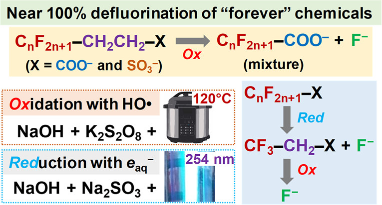

   - **Zekun Liu**, Michael J. Bentel, Yaochun Yu, Changxu Ren, Jinyu Gao, Vivek Francis Pulikkal, Mei Sun, Yujie Men, Jinyong Liu.&sect; Near-Quantitative Defluorination of Perfluorinated and Fluorotelomer Carboxylates and Sulfonates with Integrated Oxidation and Reduction. ***Environmental Science & Technology***. 2021, 55, 10, 7052-7062.  
   https://pubs.acs.org/doi/abs/10.1021/acs.est.1c00353 (open access)
   
   
   

   
   
   
   - ## Images

Upload an image to the *assets* folder and embed it with `)`. Keep in mind that the path needs to be adjusted if Jekyll is run inside a subfolder.

A wrapper `div` with the class `large` can be used to increase the width of an image or iframe.

## Embedded content

You can also embed a lot of stuff, for example from YouTube, using the `embed.html` include.


   - 
   - 
   - **Best Poster Presentation Award in [CAPEES](http://www.capees.org/bylaws.html) Student E-Poster Competition.** &emsp; (**07/2021**)
   - **C. Ellen Gonter Environmental Chemistry Awards.** These awards represent the highest honor granted by the [ACS Division of Environmental Chemistry](https://acsenvr.com/website/) for students. &emsp; (**04/2021**) 
   - **3rd Prize in [Geosyntec Student Paper Competition](https://geosyntec.com/news/item/6782-geosyntec-announces-winners-of-2020-student-paper-contest).** &emsp; (**04/2020**)
   - **ACS ENVR Certificate of Merit, Fall 2019, San Diego.** &emsp; (**08/2019**)
   - **Dean's Distinguished Fellowship Award, University of California, Riverside.** &emsp; (**02/2018**)
